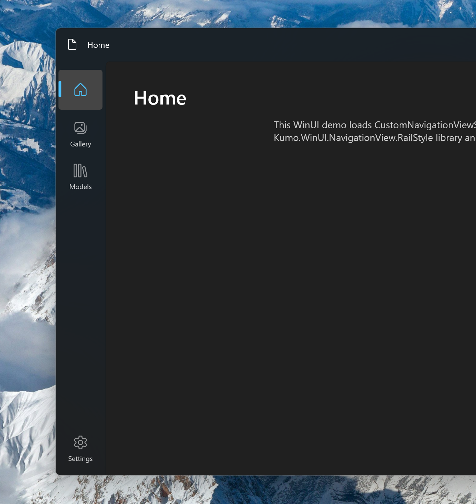

# WinUI Rail NavigationView

Rail style NavigationView for WinUI and UWP.

[](https://www.nuget.org/packages/Kumo.WinUI.NavigationView.RailStyle)
[](https://www.nuget.org/packages/Kumo.Uwp.NavigationView.RailStyle)



## Usage

Merge the resource dictionary after `XamlControlsResources`.

```xml
<ResourceDictionary.MergedDictionaries>
    ...
    <RailNavigationViewResources xmlns="using:Kumo.WinUI.NavigationView.RailStyle" />
</ResourceDictionary.MergedDictionaries>
```

Apply the style explicitly:

```xml
<NavigationView Style="{StaticResource RailNavigationViewStyle}" />
```

## Samples

- `WinUIApp` demonstrates the WinUI 3 package and a title-bar back button connected to `Frame` navigation.
- `UwpApp` demonstrates the UWP package.

## Source Notice

The rail `NavigationView` template is derived from Microsoft AI Dev Gallery's `NavigationView.xaml`, licensed under the MIT License.
